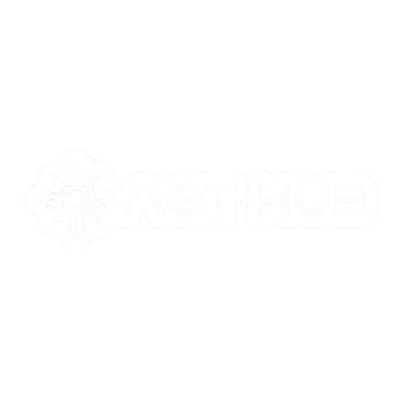

<div align="center">



# ⚜️ AGT HUB PORTFOLIO ⚜️
### *Sacred Tradition. Digital Frontier.*

[](https://reactjs.org/)
[](https://www.typescriptlang.org/)
[](https://vitejs.dev/)
[](https://www.framer.com/motion/)

---

**AGT Hub** is an innovation ecosystem within **ASTU Gibi Gubaie**, supported by **Mahbere Kidusan**. This portfolio serves as a digital bridge between timeless faith and modern engineering excellence.

[Explore Archives](#-project-archives) • [Meet Laureates](#-the-laureates) • [View Chronology](#-chronology) • [Philosophy](#-the-philosophy)

</div>

## 🌌 The Vision
We believe that technology is a powerful tool to preserve and propagate sacred heritage in the digital age. AGT Hub empowers the next generation of Christian technologists to serve through excellence, rooted in tradition and scaling with innovation.

---

## 🛠️ Tech Stack
| Core | UI / Motion | Integration |
| :--- | :--- | :--- |
| **React 18** | **Vanilla CSS (Premium)** | **Google Sheets API** |
| **TypeScript** | **Motion/React (Framer)** | **Lucide Icons** |
| **Vite** | **Custom StarField** | **Vite Env Config** |

---

## ✨ Key Features

### 🏛️ Project Archives
A curated collection of solutions built for the Church and community, ranging from **Zema Digitization** to **Ethiopic OCR** research. Fully filterable by category.

### 🎖️ The Laureates
A high-end **Hall of Fame** honoring excellence. Features animated vignettes of winners with dynamic image loading and parchment-inspired fallbacks.

### ⏳ Chronology
An interactive timeline documenting the journey of innovation and faith, from the **Genesis Bootcamp** to the present day.

### 🌗 Dual-Mode Aesthetic
- **Dark Mode**: Deep space aesthetic with twinkling star fields and gold-glow accents.
- **Light Mode**: A "Sacred Manuscript" vibe featuring parchment textures, Sacred Navy (`#142B6F`) typography, and bronze detailing.

---

## 🚀 Getting Started

### Prerequisites
- [Node.js](https://nodejs.org/) (v18+)
- [Google Sheets ID](https://docs.google.com/spreadsheets/d/YOUR_ID/edit) (Optional, for dynamic data)

### Installation

1. **Clone the repository**
   ```bash
   git clone https://github.com/your-username/agt-hub-portfolio.git
   cd agt-hub-portfolio
   ```

2. **Install dependencies**
   ```bash
   npm install
   ```

3. **Configure Environment Variables**
   Create a `.env` file in the root:
   ```env
   VITE_GOOGLE_SHEET_ID=your_google_sheet_id_here
   ```

4. **Launch Development Server**
   ```bash
   npm run dev
   ```

---

<div align="center">

### ⛪ Rooted in Tradition. Scaling with Technology.
Built with ❤️ by the **ASTU Gibi Gubaie Tech Team**

[Website](https://agthub.org) • [Instagram](https://instagram.com/agthub) • [Telegram](https://t.me/agthub)

</div>
